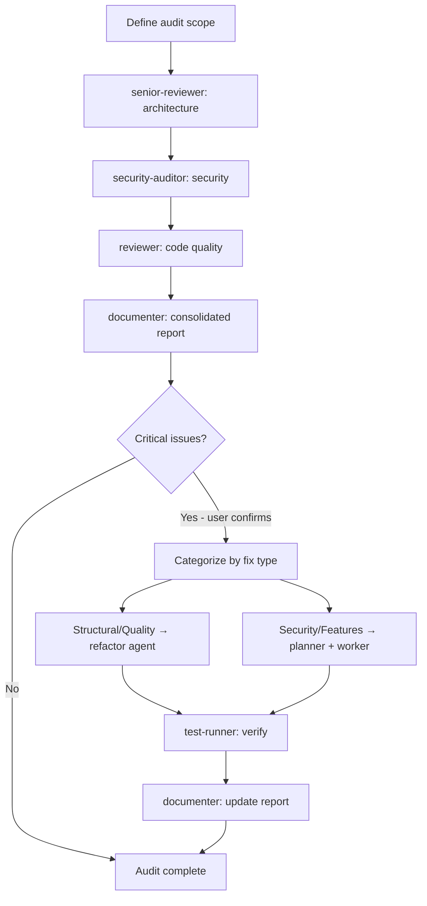

# Audit Workflow Skill

**Purpose**: Orchestrate a project health audit using senior-reviewer + security-auditor + reviewer, aggregate into a report, then optionally route critical findings into the appropriate fix workflow — all in the same chat.

---

## Workflow Architecture



**Phases 1–4 are always read-only. Phase 5 runs only with explicit user confirmation.**

All analysis phases are **sequential** — each agent receives context from the previous one to avoid duplicate findings and add depth.

---

## Step 1: Define Scope

Parse the user's input to determine what to audit:

```
/audit                        → full project (src/ or project root)
/audit src/services/          → specific directory
/audit src/auth.ts            → single file (thorough review)
/audit --since main           → only files changed vs main branch
/audit --since HEAD~10        → last 10 commits
```

For `--since` variants, run `git diff --name-only [ref]` to get the file list, then pass those files as scope to each agent.

If no scope given, default to the project's main source directory (check `package.json`, `src/`, `app/`, or ask the user if ambiguous).

---

## Step 2: Architecture Review (senior-reviewer)

**Goal**: Identify structural, design, and architectural issues.

**Checklist for senior-reviewer:**
- SOLID principles adherence
- Layered architecture (separation of concerns, dependency direction)
- Design pattern usage (correct, missing, misapplied)
- Module boundaries and coupling
- Circular dependencies
- God classes / God modules
- Scalability concerns (stateful components, caching, bottlenecks)
- Over-engineering or premature abstraction

**Expected output format:**
```markdown
## Architecture Findings

### Critical
- [A1] Circular dependency: services/user.ts ↔ services/auth.ts

### High
- [A2] God module: utils/helpers.ts (850 lines, mixed concerns)

### Medium
- [A3] Missing repository pattern in services/ — direct DB calls

### Low
- [A4] Strategy pattern opportunity in pricing logic
```

---

## Step 3: Security Audit (security-auditor)

**Goal**: Identify security vulnerabilities and risks.

**Context to pass**: architecture findings summary (helps auditor focus on high-risk areas like auth services, API layers).

**Checklist for security-auditor:**
- Authentication & authorization flows
- Input validation and sanitization (injection, XSS)
- Hardcoded secrets, tokens, credentials
- OWASP Top 10 coverage
- API endpoint security (rate limiting, CORS, method restrictions)
- Sensitive data handling and storage (PII, passwords, tokens)
- Dependency vulnerabilities (if `npm audit` or similar available)
- Error messages leaking internal details

**Expected output format:**
```markdown
## Security Findings

### Critical
- [S1] Hardcoded JWT secret in src/config/auth.ts:12

### High
- [S2] Missing input sanitization on /api/search endpoint

### Medium
- [S3] No rate limiting on /api/auth/login

### Low
- [S4] Missing security headers (CSP, HSTS)
```

---

## Step 4: Code Quality Review (reviewer)

**Goal**: Identify code quality, maintainability, and technical debt.

**Context to pass**: architecture + security summaries (avoids re-flagging already identified issues).

**Checklist for reviewer:**
- DRY violations (duplicated logic, copy-paste code)
- Complexity (long functions >30 lines, deep nesting >3 levels)
- Naming clarity (ambiguous vars, misleading names)
- Error handling gaps (swallowed errors, missing null checks)
- Dead code and unused imports
- Test coverage gaps (critical paths without tests)
- TypeScript: `any` types, missing types, incorrect types
- Comments: missing where needed, misleading, or outdated

**Expected output format:**
```markdown
## Code Quality Findings

### High
- [Q1] Duplicate email validation in login.ts:23 and register.ts:31

### Medium
- [Q2] processPayment() is 95 lines with 5 responsibilities
- [Q3] Error swallowed silently in src/utils/api.ts:67

### Low
- [Q4] 12 uses of `any` type in src/types/
```

---

## Step 5: Severity Aggregation

Before passing to documenter, aggregate all findings:

```javascript
allFindings = [
  ...architectureFindings,   // A1, A2, ...
  ...securityFindings,        // S1, S2, ...
  ...qualityFindings          // Q1, Q2, ...
]

severity_counts = {
  critical: allFindings.filter(f => f.severity === "Critical").length,
  high:     allFindings.filter(f => f.severity === "High").length,
  medium:   allFindings.filter(f => f.severity === "Medium").length,
  low:      allFindings.filter(f => f.severity === "Low").length
}
```

**Health Score Formula** (0–10):
```
Start at 10
- Critical finding: -2 each (max -6)
- High finding: -0.5 each (max -3)
- Medium finding: -0.1 each (max -1)
Score floored at 0, rounded to 1 decimal
```

---

## Step 6: Consolidated Report (documenter)

**Determine report path before calling documenter:**

```javascript
config = readJSON(".cursor/config.json")

auditsEnabled = config.documentation.enabled.audits  // true/false
auditsPath    = config.documentation.paths.audits     // e.g. "ai_docs/develop/audits"

if (auditsEnabled && auditsPath) {/
  // Save to configured docs path
  reportFile = `${auditsPath}/YYYY-MM-DD-{scope-slug}-audit.md`
} else {
  // Fall back to workspace — audit still saved, just not in project docs
  workspacePath = config.workspace.path  // e.g. ".cursor/workspace"
  reportFile = `${workspacePath}/audits/YYYY-MM-DD-{scope-slug}-audit.md`
}
```

Pass `reportFile` to the documenter so it saves the report to the correct location.

**Report format:**

```markdown
# Project Audit Report

**Date**: 2026-02-25
**Scope**: src/services/
**Audited by**: senior-reviewer + security-auditor + reviewer

---

## Executive Summary

**Overall Health Score**: 7.2/10

| Severity | Architecture | Security | Code Quality | Total |
|----------|-------------|----------|--------------|-------|
| Critical | 1           | 1        | 0            | **2** |
| High     | 2           | 1        | 2            | **5** |
| Medium   | 1           | 1        | 3            | **5** |
| Low      | 1           | 1        | 1            | **3** |

**Recommendation**: Address 2 critical issues before next release.

---

## Critical Issues (fix immediately)

### [A1] Circular Dependency
**Category**: Architecture
**Location**: services/user.ts ↔ services/auth.ts
**Impact**: Build issues, testing difficulties, runtime errors possible
**Fix**: Extract shared identity logic to services/identity.ts

### [S1] Hardcoded JWT Secret
**Category**: Security
**Location**: src/config/auth.ts:12
**Impact**: Secret exposed in version control — full auth compromise possible
**Fix**: Move to environment variable, rotate immediately

---

## High Priority Issues (fix soon)

[List all High severity findings with locations and suggested fixes]

---

## Medium Priority Issues (plan for next sprint)

[List all Medium severity findings]

---

## Low Priority / Suggestions

[List all Low severity findings]

---

## Priority Matrix

| ID | Issue | Severity | Effort | Priority |
|----|-------|----------|--------|----------|
| S1 | Hardcoded JWT secret | Critical | Low | P0 — now |
| A1 | Circular dependency | Critical | Medium | P0 — now |
| A2 | God module helpers.ts | High | High | P1 — sprint |
| S2 | Missing input sanitization | High | Medium | P1 — sprint |

---

## Next Steps

1. **Immediate** (before next commit): [list critical fixes]
2. **This sprint**: [list high fixes]
3. **Next sprint**: [list medium fixes]
4. **Backlog**: [list low/suggestions]

Use `/refactor [file]` for structural issues.
Use `/implement [fix]` for feature-level security fixes.
```

---

## Audit Scope Guide

| Scope | Depth | Typical duration |
|-------|-------|-----------------|
| Single file | Very thorough | Fast |
| Single module (5-10 files) | Thorough | Normal |
| Large directory (20-50 files) | Balanced | Longer |
| Full project | High-level + deep on critical areas | Long |

For full-project audits on large codebases: have each agent focus on the **most critical** 20-30% of files (core business logic, auth, API layer) rather than config files, generated code, or test files.

---

---

## Phase 5: Remediation Routing

This phase runs **only if**:
1. Critical issues were found in phases 1–3
2. User explicitly confirms when asked ("Start remediation? y/n")

### How to Ask the User

After showing the report, present a clear summary:

```
Audit complete. Health Score: X/10

Critical issues requiring immediate attention:
- [A1] Circular dependency: services/user.ts ↔ services/auth.ts  (structural)
- [S1] Hardcoded JWT secret in src/config/auth.ts:12             (security)

Start remediation for these critical issues? (y/n)
If yes, fixes will be applied in this chat automatically.
```

**Wait for the user's response before doing anything.**

### Categorizing Findings for Routing

After user confirms, split critical findings into two buckets:

**Bucket A — Structural / Code Quality** (fix via refactor agent):
- Circular dependencies
- God classes / modules
- Deep nesting / long functions
- DRY violations
- SOLID violations
- Complexity / code smells

**Bucket B — Security / Behavioral** (fix via planner + worker):
- Hardcoded secrets / credentials
- Missing input validation / sanitization
- Authentication / authorization gaps
- Missing rate limiting
- Any fix that requires adding new logic, not just restructuring existing code

### Executing Bucket A (Structural → refactor agent)

```
Task(
  subagent_type="refactor",
  prompt="Fix the following structural issues found during audit:
  [list each finding with file path and description]
  
  Context: these were identified by senior-reviewer during a full audit.
  Rules: no behavior changes, all existing tests must pass after refactoring."
)
```

Then verify:
```
Task(
  subagent_type="test-runner",
  prompt="Verify refactoring did not break anything.
  Files changed: [from refactor agent]"
)
```
- If tests fail → `Task(subagent_type="debugger")` → retry test-runner (max 3)

### Executing Bucket B (Security / Behavioral → planner + worker)

```
Task(
  subagent_type="planner",
  prompt="Create a remediation plan for these security/behavioral issues:
  [list each finding with file path, description, and suggested fix]
  
  Each issue should be one task. Keep tasks small and independent."
)
```

Then for each task from the planner, execute the standard cycle:
```
Task(subagent_type="worker", ...)
Task(subagent_type="test-writer", ...)     ← write tests for the fix
Task(subagent_type="test-runner", ...)
  → If fail: Task(subagent_type="debugger") → retry (max 3)
Task(subagent_type="security-auditor", ...)  ← verify the specific fix
  → If issues: Task(subagent_type="debugger") → retry (max 3)
```

### After All Fixes Applied

Update the audit report to reflect what was done:

```
Task(
  subagent_type="documenter",
  prompt="Update the audit report to add a Remediation section:
  Report: [original report path or content]
  
  Add:
  ## Remediation Applied
  Date: [today]
  
  ### Fixed
  - [A1] Circular dependency → resolved by extracting services/identity.ts
  - [S1] Hardcoded JWT secret → moved to environment variable
  
  ### Remaining (High/Medium/Low — not auto-fixed)
  [list remaining non-critical findings from original report]"
)
```

### Remediation Decision Matrix

| Finding Type | Bucket | Agent |
|-------------|--------|-------|
| Circular dependency | A | refactor |
| God class / long function | A | refactor |
| Code duplication | A | refactor |
| Deep nesting | A | refactor |
| Hardcoded secret | B | planner + worker |
| Missing validation | B | planner + worker |
| Auth/authz gap | B | planner + worker |
| Missing rate limiting | B | planner + worker |
| Missing security headers | B | planner + worker |

---

## What Audit Does NOT Auto-Fix

- High / Medium / Low issues (reported, not auto-fixed)
- Issues requiring large architectural redesign (discuss with user first)
- Issues in third-party/vendor code

For remaining issues after audit, user can:
- Run `/refactor [file]` on specific structural issues
- Run `/orchestrate` to tackle a larger remediation plan
