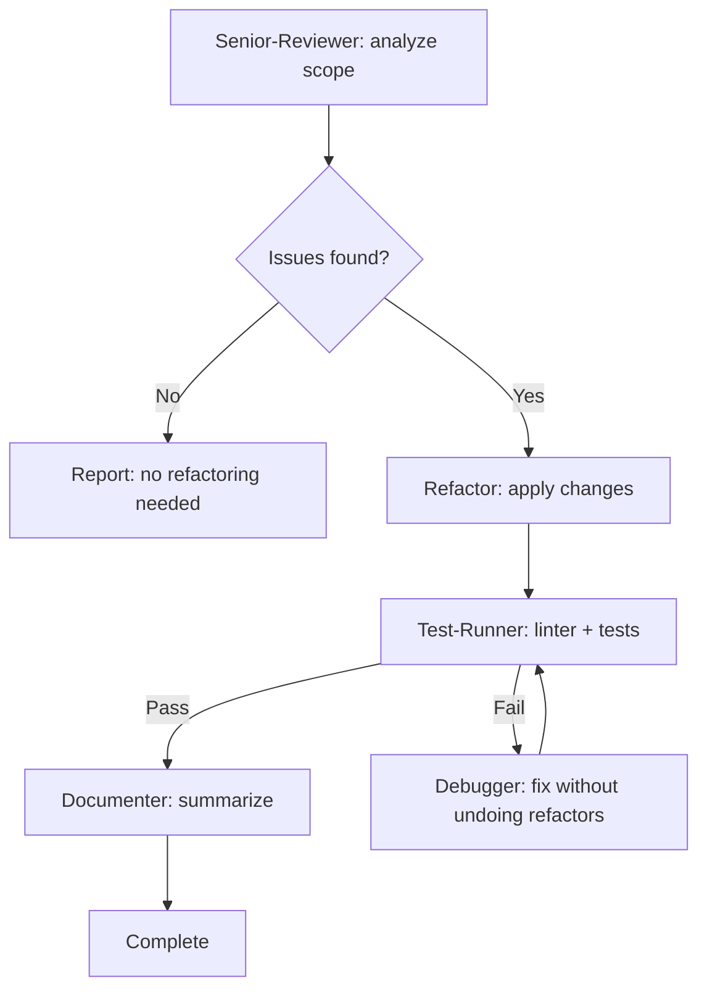

# Refactor Workflow Skill

**Purpose**: Orchestrate a safe, test-verified refactoring cycle using senior-reviewer → refactor → test-runner → documenter.

---

## Workflow Architecture



**Max retries**: 3 per stage. If exceeded, pause and report to user.

---

## Step 1: Define Scope

Before calling any agent, extract the refactoring scope from the user input:

```
/refactor src/utils/helpers.ts              → single file
/refactor src/services/                     → directory
/refactor "Extract auth logic from UserService" → intent-based
/refactor                                   → recent git changes (use git diff)
```

If scope is unclear, ask the user to specify files, a directory, or a goal.

---

## Step 2: Pre-condition Check — Tests Must Exist

**CRITICAL**: Before refactoring, verify tests exist for the target code.

```
If no tests found for the target:
  → Warn the user: "No tests found for [scope]. Refactoring without tests is risky.
     Recommend: run /implement to add tests first, then /refactor."
  → Ask: "Continue anyway? (risky) or add tests first?"
  → If user says continue: proceed with extra caution, no behavior changes
```

---

## Step 3: Analysis Phase (senior-reviewer)

Call senior-reviewer with explicit instructions to **analyze only, not fix**.

**What to ask for:**
- Code smells by location (file + approximate line range)
- Specific refactoring type recommended for each smell
- Priority: High / Medium / Low
- Dependencies: which smells are blocking others

**Smell categories to look for:**

| Smell | What It Looks Like | Refactoring |
|-------|-------------------|-------------|
| Long function | >30 lines, multiple responsibilities | Extract Function |
| God class | >300 lines, does everything | Extract Class |
| Duplicate code | Same logic in 2+ places | Extract + Reuse |
| Deep nesting | >3 levels of if/for | Guard Clauses, Early Return |
| Feature envy | Class uses another class's data excessively | Move Method |
| Data clump | Same 3+ params appear together repeatedly | Extract Object |
| Primitive obsession | Strings/numbers instead of types | Value Objects |
| Switch on type | Long if/switch on string type | Polymorphism / Strategy |
| Shotgun surgery | One change requires edits in many files | Move + Consolidate |

**Output expected from senior-reviewer:**
```markdown
## Refactoring Analysis

### Target 1 — [High] Long function
File: src/services/auth.ts, lines 45-120
Smell: processLogin() does validation, DB lookup, token creation, and logging
Recommended: Extract Function × 3

### Target 2 — [Medium] Duplicate validation
Files: src/api/login.ts:23, src/api/register.ts:31
Smell: Same email + password validation repeated
Recommended: Extract to src/utils/validation.ts
```

---

## Step 4: Refactoring Phase (refactor agent)

Pass the complete analysis output to the refactor agent.

**Key instructions to include:**
- The full list of targets from senior-reviewer
- Original scope/files
- "Apply refactorings in priority order"
- "Stop and report if any refactoring would require behavior change"
- "Do NOT add new features, new tests, or change public interfaces"

**What refactor agent should do:**
1. Read code-quality-standards skill
2. Apply each refactoring in small steps
3. After each step: verify code compiles / has no obvious breakage
4. Report before/after for each change

---

## Step 5: Verification Phase (test-runner)

After refactor agent completes, verify nothing broke.

**What to ask test-runner:**
- Run linter on all changed files
- Run full test suite (or tests related to changed files if faster)
- Confirm: no new failures compared to pre-refactor state

**If tests fail:**
```
→ Call debugger with:
  - Which test failed
  - What refactoring caused it
  - Constraint: "Fix the test failure WITHOUT undoing the refactoring.
    The refactoring was correct — there may be an import path change,
    a renamed symbol, or a moved function that tests need to update."
→ Re-run test-runner
→ Max 3 retries
→ If still failing after 3: pause, report full details to user
```

---

## Step 6: Documentation Phase (documenter)

After verification passes, document the session.

**What documenter should produce:**
```markdown
## Refactoring Report

**Date**: 2026-02-25
**Scope**: src/services/auth.ts
**Triggered by**: /refactor command

### Changes Applied

1. Extracted validateCredentials() from processLogin()
   - Before: 1 function, 85 lines
   - After: 3 functions, avg 28 lines each

2. Moved duplicate email validation to src/utils/validation.ts
   - Files updated: src/api/login.ts, src/api/register.ts, src/utils/validation.ts

### Metrics
- Functions extracted: 3
- Duplicate code removed: ~40 lines
- Files changed: 4
- Tests: 12/12 passing (no regressions)

### Remaining Issues (not addressed)
- [any smells the senior-reviewer flagged but were out of scope]
```

---

## Retry Logic

```
test-runner FAIL → debugger (fix import/symbol issues, not logic) → test-runner
  Max 3 attempts
  If still failing: report to user with:
    - What was refactored
    - What test is failing
    - What debugger attempted
    - Ask: revert this specific refactoring? or investigate manually?
```

---

## Refactor vs Rewrite Decision

| Signal | Recommendation |
|--------|---------------|
| Code is complex but tests pass | Refactor (safe) |
| Code has no tests | Add tests first with /implement |
| Logic is wrong AND messy | Fix bugs first (/implement), then refactor |
| Module needs completely different design | Discuss with user — may need /orchestrate |
| Changing public API surface | NOT a refactor — use /orchestrate |

---

## Scope Sizing

Keep each refactoring session focused:

| Scope | Max files | Recommended |
|-------|-----------|-------------|
| Single function | 1 | ✅ Ideal |
| Single file | 1 | ✅ Great |
| One module/directory | 3-5 | ✅ Fine |
| Multiple modules | 6-10 | ⚠️ Break into sessions |
| Entire codebase | >10 | ❌ Too big — scope it down |

Large refactors should be broken into multiple `/refactor` sessions, each targeting one module or concern.
