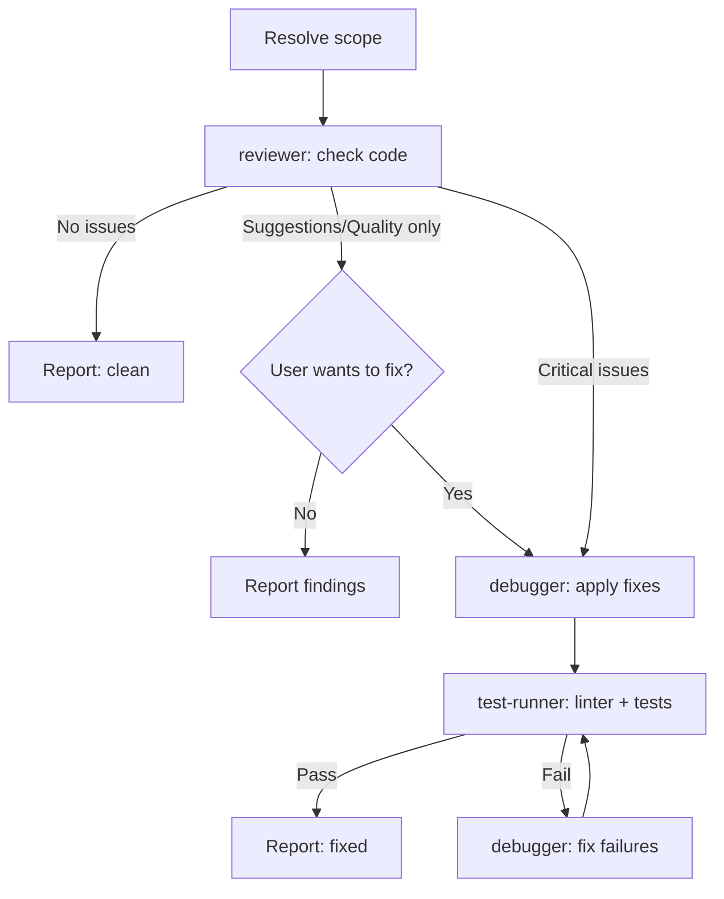

# Review Workflow Skill

**Purpose**: Run reviewer → optional debugger fix → test-runner verification for targeted code review.

---

## Workflow Architecture



---

## How It Works

### Step 0 — Resolve Scope

```
/review                     # Staged changes (pre-commit)
/review src/components/     # Specific directory
/review src/auth.ts         # Single file
/review --staged            # Explicitly staged changes only
/review --last-commit       # Changes in last commit
```

If no scope given, default to **staged changes** (`git diff --staged`).
If nothing staged, fall back to **recent changes** (`git diff HEAD`).
If still nothing, ask the user to specify files.

### Step 1 — Code Review

**REQUIRED: Call Task tool with subagent_type="reviewer"**

```
Task(
  subagent_type="reviewer",
  prompt="Review the following: [scope/files/staged changes].
  Check for: bugs, security issues, DRY violations, SOLID violations,
  complexity, naming, error handling, TypeScript issues.
  Categorize findings as Critical / Quality / Suggestion.
  Include specific file paths and line numbers."
)
```

Wait for completion. Extract findings by category.

**If NO issues found** → report ✅ to user and stop.

**If only Suggestions/Quality (non-critical)** → report findings to user, ask:
- "Fix these now?" → proceed to Step 2
- "Just report" → stop, no further steps

**If Critical issues found** → always proceed to Step 2 (ask user first if scope is large).

### Step 2 — Auto-Fix (conditional)

**Only run if: critical issues found, OR user chose to fix quality issues.**

**REQUIRED: Call Task tool with subagent_type="debugger"**

```
Task(
  subagent_type="debugger",
  prompt="Fix the following code review issues:

  Critical issues: [list from Step 1]
  Quality issues (if user approved): [list from Step 1]

  Files: [list of files]
  
  Fix each issue. Do NOT refactor beyond what's needed to fix the reported problems.
  Do NOT add new features."
)
```

Wait for completion. Extract what was fixed.

### Step 3 — Verification (conditional)

**Only run if Step 2 ran (fixes were applied).**

**REQUIRED: Call Task tool with subagent_type="test-runner"**

```
Task(
  subagent_type="test-runner",
  prompt="Verify fixes did not break anything.
  Files changed: [list from Step 2]
  Fixes applied: [summary from Step 2]
  
  Run: linter + tests."
)
```

- If tests fail → **REQUIRED: Call Task(subagent_type="debugger")** with error details → retry test-runner
- Max 3 retries. If still failing: report to user.

---

## Important Rules

1. **DO NOT write any code yourself** — you are the coordinator, not the implementer
2. **DO NOT edit any files yourself** — all changes happen through subagents
3. **EVERY step MUST use the `Task` tool** with the correct `subagent_type`
4. **Always ask before fixing** non-critical (quality/suggestion) issues
5. **Pass context forward**: tell each agent what the previous one found/did

---

## Progress Reporting

After each subagent call, report to the user:
- What was reviewed (files/scope)
- Findings breakdown (critical / quality / suggestions)
- Whether fixes were applied
- Final: ✅ clean / ⚠️ issues remaining / ❌ failures

## Example Progress Output

```
**Reviewing: staged changes (3 files)**
→ reviewer: ⚠️ Issues found
  - 🔴 1 critical: null pointer in user.ts:45
  - 🟡 2 quality: DRY violation, magic number
  - 🟢 1 suggestion: memoization opportunity

→ debugger: ✅ Fixed critical + quality issues
→ test-runner: ✅ All passing

Summary: 3 issues fixed. 1 suggestion left for later.
```

---

## When to Use

Good for:
- Before committing (pre-commit review)
- After finishing a feature, before creating a PR
- When reviewer flags something in orchestrate but you want standalone fix
- Quick sanity check on a specific file

NOT good for:
- Full project health check (use `/audit`)
- Planned architectural improvements (use `/refactor`)
- Implementing new features (use `/implement` or `/orchestrate`)

## Example Tasks

Good for `/review`:
- `git diff --staged` before committing
- Single file after a quick change
- A PR branch vs main

Not good for `/review` (use `/audit`):
- Entire codebase
- Full module architecture evaluation
