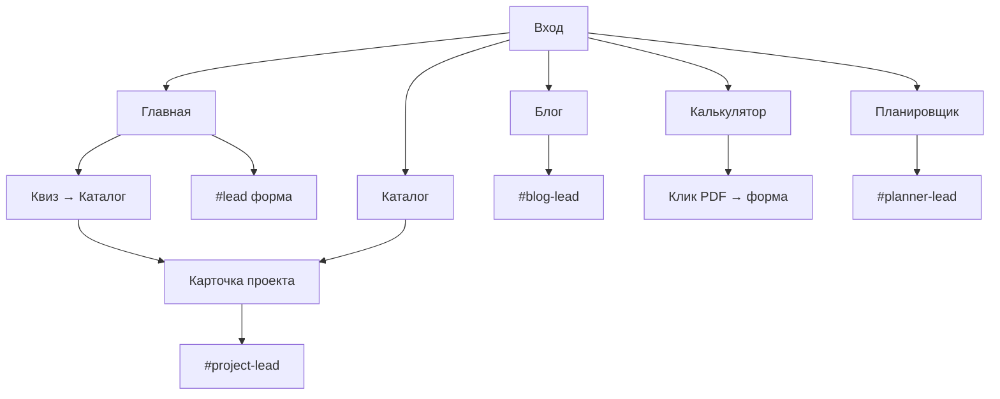

# Этап 1: Аудит сайта строительной артели Александра Войткевича

**URL:** https://voytkevich-artel.vercel.app/  
**Дата аудита:** 5 июня 2026  
**Стек:** Next.js 16 App Router, TypeScript, Tailwind CSS v4, локальные данные (CMS-заглушка)  
**Бизнес-цель:** генерация заявок на строительство домов под ключ в Иркутске и области

---

## 1. Краткое резюме

### Что сайт уже делает хорошо

- **Визуально зрелый продукт:** премиальная типографика, анимации, glass-эффекты, продуманная иерархия — сайт не выглядит как типовой шаблон строительной компании.
- **Полноценная воронка инструментов:** главная → каталог (43 проекта) → карточка проекта → калькулятор → планировщик → блог → формы заявок.
- **SEO-фундамент заложен:** `metadataBase`, шаблон title, canonical, `robots.txt`, `sitemap.xml`, JSON-LD (Organization, Product, Article, FAQ), ЧПУ для проектов и статей.
- **Калькулятор и планировщик** — редкое конкурентное преимущество: разбивка сметы, передача параметров в заявку, подбор похожего проекта из каталога.
- **Единый копирайт** в `src/data/copy.ts` — CTA, блоки доверия, комплектация согласованы по всему сайту.
- **Техническая сборка стабильна:** `npm run build` — успешно, 64 статические страницы (43 проекта + 7 статей + служебные).

### Готовность к генерации заявок: **6/10**

Формы есть на главной, в калькуляторе, планировщике, FAQ, блоге и карточках проектов. Telegram-API для лидов реализован. Но: нет CRM, PDF-смета не выдаётся (обещание в CTA), лиды без env молча «успешны», квалификация лида слабая (только имя/телефон на первом шаге), нет сценарных форм под разные точки входа.

### Основные слабые места, мешающие продажам

| Проблема | Влияние |
|----------|---------|
| H1 эмоциональный, без коммерческого ключа «строительство домов под ключ в Иркутске» | Слабый оффер для холодного трафика |
| Нет отзывов, кейсов с доказательствами, примеров сметы/договора | Доверие не подкреплено фактами |
| 43 проекта с **одинаковым** описанием-шаблоном | Карточки не убеждают, выглядят как каталог-заглушка |
| CTA «PDF-смета» без генерации PDF | Разрыв ожиданий → отток после клика |
| Планировщик показывал **0 м²** на первом экране (гидратация) | Подрывает доверие к инструменту |
| Футер-ссылка «До 10 млн» вела на сортировку, а не фильтр цены | Пользователь получает не то |
| Нет SEO-лендингов под категории (одноэтажные, до 100 м², газобетон…) | Упущенный органический трафик |

### Проблемы, мешающие SEO-продвижению

- Нет кластерных посадочных страниц каталога (`/catalog/odnoetazhnye`, `/catalog/do-100-m2` и т.д.).
- Блог — 7 статей, без полноценной перелинковки и CTA внутри контента; таблицы в markdown **не рендерятся**.
- Нет `AggregateRating` / `Review` schema при заявленном рейтинге 4.9.
- Главная не имеет отдельного `pageMetadata` — наследует общий title (приемлемо, но H1 ≠ title).
- Региональность есть в meta description, но слабо в H1/H2 контенте карточек и каталога.
- `sitemap.xml` на продакшене при проверке отдавал **500** (локально генерируется корректно — проверить env на Vercel).

### Элементы, выглядящие как прототип / недоделка

- Фото команды, кейсов, партнёров — **Unsplash / placehold.co**, не реальные объекты.
- Команда без имён (кроме основателя): «Руководитель проекта», «Архитектор».
- Партнёры Knauf, Rockwool — placeholder-логотипы.
- Описания всех 43 проектов — один текст из `projectDescriptionDefault`.
- Favorites и «недавно просмотренные» пишутся в localStorage, но **нигде не показываются**.
- Нет страницы политики конфиденциальности (только текст согласия на форме).

### Зоны доработки в первую очередь

1. **Доверие:** реальные фото объектов, отзывы, пример сметы, кейсы с привязкой к каталогу.
2. **Первый экран + H1:** коммерческий оффер с регионом и конкретикой.
3. **Карточки проектов:** уникальные описания, «что входит в цену», похожие проекты, FAQ по проекту.
4. **SEO-категории каталога:** посадочные под семантическое ядро.
5. **Формы и CRM:** квалификация лида, PDF/смета, интеграция, аналитика целей.

---

## 2. Аудит структуры сайта

### Карта маршрутов

| Маршрут | Файл | Назначение |
|---------|------|------------|
| `/` | `src/app/page.tsx` | Главная-лендинг |
| `/catalog` | `src/app/catalog/page.tsx` | Каталог 43 проектов |
| `/catalog/[slug]` | `src/app/catalog/[slug]/page.tsx` | Карточка проекта |
| `/calculator` | `src/app/calculator/page.tsx` | Калькулятор стоимости |
| `/planirovka` | `src/app/planirovka/page.tsx` | Планировщик дома |
| `/process` | `src/app/process/page.tsx` | 7 этапов строительства |
| `/about` | `src/app/about/page.tsx` | О компании |
| `/blog` | `src/app/blog/page.tsx` | Индекс блога (7 статей) |
| `/blog/[slug]` | `src/app/blog/[slug]/page.tsx` | Статья |
| `/faq` | `src/app/faq/page.tsx` | FAQ + форма |
| `/api/leads` | `src/app/api/leads/route.ts` | Приём заявок → Telegram |

**Навигация (header):** Каталог, Калькулятор, Планировщик, Процесс, О компании, Блог.  
**Не в header:** FAQ (только футер + тизер на главной).  
**Глобальные виджеты:** sticky CTA → `/#lead`, WhatsApp/Telegram.

---

### Главная `/`

| Критерий | Оценка |
|----------|--------|
| **Назначение** | Точка входа, презентация ценности, быстрый расчёт, квиз, заявка |
| **Работает хорошо** | Hero с мини-калькулятором, 3 featured-проекта, статистика, блоки «для кого», комплектация, процесс, доверие, квиз, форма, FAQ-тизер, блог-тизер |
| **Мешает конверсии** | H1 без коммерческого ключа; CTA «Получить расчёт» уводит вниз страницы; нет социального доказательства (отзывы) на первых экранах |
| **Мешает SEO** | H1 не содержит «Иркутск» / «под ключ»; нет отдельной schema для FAQ на главной (только 4 из 7 вопросов) |
| **Добавить** | Блок отзывов, 1–2 реальных кейса, видео со стройки, sticky оффер с телефоном |
| **Убрать/переработать** | Квиз «AI-подбор» — переименовать (нет AI), усилить связь с заявкой после квиза |
| **CTA** | ✅ Есть: расчёт, каталог, форма `#lead`. Нужен: «Позвонить», «Скачать чек-лист» |

---

### Каталог `/catalog`

| Критерий | Оценка |
|----------|--------|
| **Назначение** | Выбор готового проекта, фильтрация, сравнение |
| **Работает хорошо** | 43 проекта с ценой/площадью/материалом; фильтры: поиск, площадь, цена, материал, стиль, терраса/гараж/сауна, сортировка; сравнение до 3; блок адаптации; промо планировщика |
| **Мешает конверсии** | Нет фильтра этажности в UI (только через URL); нет быстрых пресетов «до 5 млн», «100–150 м²» |
| **Мешает SEO** | Одна страница на все запросы; нет H1 под кластеры; нет `ItemList` schema |
| **Добавить** | SEO-посадочные, чипы-фильтры, счётчик результатов, блок «популярные категории» |
| **CTA** | «Получить консультацию» (→ `/#lead`), на карточках — «Получить смету» |

---

### Карточка проекта `/catalog/[slug]`

| Критерий | Оценка |
|----------|--------|
| **Назначение** | Мини-лендинг проекта → заявка на смету |
| **Работает хорошо** | Галерея, цена, планировки (интерактив), комплектации, этапы, FAQ (3 общих), форма с `source=project-{slug}`, Product schema |
| **Мешает конверсии** | Одинаковое описание у всех; нет «что входит в цену» отдельным блоком; нет похожих проектов; FAQ не про конкретный проект |
| **Мешает SEO** | Title/description из `project.seo` — ок, но thin content из-за шаблонного body |
| **Добавить** | Уникальный текст, «для кого подходит», адаптации, похожие проекты, калькулятор/виджет на странице |
| **CTA** | ✅ «Получить смету по этому проекту» → `#project-lead` |

---

### Калькулятор `/calculator`

| Критерий | Оценка |
|----------|--------|
| **Назначение** | Квалификация лида по бюджету |
| **Работает хорошо** | 7 параметров, разбивка, ₽/м², срок, disclaimer, передача в LeadForm, промо планировщика |
| **Мешает конверсии** | «PDF-смета» — PDF не генерируется; форма появляется только после клика (доп. шаг) |
| **Мешает SEO** | Нет FAQ/schema Calculator; слабая перелинковка из статей (есть 1 ссылка) |
| **CTA** | ✅ «Получить предварительную смету PDF» → форма |

---

### Планировщик `/planirovka`

| Критерий | Оценка |
|----------|--------|
| **Назначение** | Эскиз планировки → подбор проекта → заявка на проектирование |
| **Работает хорошо** | Параметры, drag-комнаты, оценка стоимости, match с каталогом, богатый `prefilledComment`, disclaimer |
| **Мешает конверсии** | **Баг:** «Сумма комнат» показывала 0 м² до гидратации; нет сценариев «дом для семьи» и т.д. |
| **Мешает SEO** | Title ок, но мало текстового контента для индексации |
| **CTA** | Телефон, похожий проект, «Заказать проектирование» |

---

### Процесс `/process`

| Критерий | Оценка |
|----------|--------|
| **Назначение** | Снятие страхов через прозрачность этапов |
| **Работает хорошо** | 7 этапов с фото, сроками, описаниями |
| **Мешает конверсии** | Нет формы внизу страницы |
| **Мешает SEO** | Нет FAQ/schema HowTo |
| **CTA** | Только ссылки из других страниц — **добавить форму** |

---

### О компании `/about`

| Критерий | Оценка |
|----------|--------|
| **Назначение** | Доверие, команда, история, объекты |
| **Работает хорошо** | Основатель, статистика, timeline, карта объектов, лицензии |
| **Мешает конверсии** | Stock-фото; команда без имён; кейсы не связаны с каталогом |
| **Мешает SEO** | Нет LocalBusiness с geo; слабые ключи в H1 |
| **CTA** | Кнопка к `/#lead` у основателя |

---

### Блог `/blog` и `/blog/[slug]`

| Критерий | Оценка |
|----------|--------|
| **Назначение** | SEO-трафик → экспертность → заявка |
| **Работает хорошо** | 7 статей, категории, Article schema, ссылки на калькулятор/каталог в тексте |
| **Мешает конверсии** | CTA только внизу; нет mid-article CTA, нет встроенного калькулятора |
| **Мешает SEO** | Таблицы не рендерятся; мало статей для ядра; нет hub-страниц кластеров |
| **CTA** | LeadForm «Нужна консультация?» внизу статьи |

---

### FAQ `/faq`

| Критерий | Оценка |
|----------|--------|
| **Назначение** | Снятие возражений + заявка |
| **Работает хорошо** | 7 вопросов, FAQPage schema, форма |
| **Мешает конверсии** | Не в главном меню |
| **CTA** | ✅ Форма внизу |

---

### Формы заявок

Единый компонент `LeadForm` — 3 шага: (1) имя + телефон, (2) площадь, (3) комментарий.  
Экземпляры: `#lead`, `#calc-lead`, `#planner-lead-form`, `#project-lead`, `#blog-lead`, FAQ.

### Навигация и футер

- Header: логичный, дублирует CTA планировщика.
- Footer: контакты, 3 колонки ссылок. **Исправлено:** «До 10 млн» → `?priceMax=10000000`.
- Sticky CTA на мобильных → `/#lead`.

### Мобильная версия

- Адаптивная сетка, мобильное меню, sticky CTA.
- Фильтры каталога — выезжающая панель.
- Планировщик — drag пальцем заявлен.

---

## 3. Аудит первого экрана главной страницы

### Чеклист

| Критерий | Статус | Комментарий |
|----------|--------|-------------|
| Быстро понятно, чем занимается компания | ⚠️ Частично | Label «Иркутск · Дома под ключ с 2014» — ок; H1 эмоциональный |
| SEO «строительство домов под ключ в Иркутске» | ❌ | В title/description — да; в H1 — нет |
| Сильный оффер | ⚠️ | Subheadline хороший (смета, фотоотчёты), но H1 не продаёт |
| Понятно, зачем оставить заявку | ✅ | Subheadline + мини-калькулятор дают повод |
| Доверие на первом экране | ⚠️ | 127 домов, 98% в срок — есть; отзывов/фото объектов — нет |
| Конкретика: сроки, смета, гарантия, фотоотчёты | ✅ | В subheadline и microTrust |
| Видна кнопка целевого действия | ✅ | «Получить предварительный расчёт» + «Посмотреть проекты» |

### Текущий H1

> «Строим дома, в которых хочется жить»

Эмоционально сильный, но **не коммерческий** и **не региональный**.

### 5 вариантов усиленного H1

1. **Строительство домов под ключ в Иркутске с понятной сметой и фотоотчётами**
2. **Построим дом под ключ в Иркутске: проект, смета, этапы и сдача в одном договоре**
3. **Дом под ключ без скрытых доплат: считаем, проектируем, строим и показываем каждый этап**
4. **Загородный дом в Иркутской области под ключ — от 80 м² с фиксированной сметой в договоре**
5. **Строим дома в Иркутске для семьи: проект, прозрачная смета, гарантия до 5 лет**

---

## 4. Аудит конверсии

### Пути пользователя



### Точки потери и слабые места

| Путь | Проблема |
|------|----------|
| Главная → заявка | Длинная страница; форма внизу; sticky CTA помогает на мобильных |
| Блог → заявка | CTA только в конце; нет urgency; нет lead-magnet |
| Карточка → заявка | Хорошо, но нет промежуточного «задать вопрос в WhatsApp» с контекстом проекта |
| Калькулятор → заявка | Лишний клик до формы; обещание PDF не выполняется |
| Планировщик → заявка | Баг 0 м² подрывал доверие; форма далеко внизу |
| Квиз → каталог | Нет прямого CTA на заявку после квиза (только вторичная ссылка на `/#lead`) |
| Процесс / About | **Нет формы** — пользователь уходит |

### Аудит форм

| Параметр | Текущее состояние |
|----------|-------------------|
| Поля | Имя, телефон, площадь (опц.), комментарий (опц.) |
| Квалификация | Слабая — бюджет, участок, сроки только в комментарии |
| Что получит после отправки | «Менеджер свяжется» — без конкретики (смета за 24ч обещана только на главной) |
| Сценарные формы | Частично через `source`, но UI одинаковый |
| Передача из калькулятора/проекта | ✅ area + comment с параметрами |
| CRM | ❌ Только Telegram (если env задан) |

### Рекомендуемые формы

| Сценарий | Поля | Особенности |
|----------|------|-------------|
| Быстрая заявка | Имя, телефон | 1 шаг, в header/sticky |
| Заявка на расчёт | + площадь, материал | После калькулятора, auto-fill |
| После калькулятора | Все параметры calc в comment | + обещание звонка за 2ч |
| Из карточки проекта | + slug проекта | Уже есть `source` |
| Из блога | + slug статьи | **Исправлено:** `source=blog-{slug}` |
| Разбор участка | Адрес/район, есть ли участок, коммуникации | Отдельная форма на /about или лендинг |

---

## 5. Аудит каталога проектов

### Текущее состояние

- **43 проекта** из `megaartel-scraped.json`, без дублей slug.
- Фильтры: поиск, площадь, цена, материал, стиль, терраса/гараж/сауна, сортировка.
- **Нет UI** для этажности и спален (логика в `filters.ts` есть).
- Категорий как страниц **нет**.

### Чего не хватает для SEO-системы

| Целевой запрос | Статус |
|----------------|--------|
| Одноэтажные дома | Только `?floors=1` в URL, нет страницы |
| Двухэтажные дома | Footer-ссылка `?floors=2` |
| Дома до 100 м² | Нет пресета |
| Дома 100–150 м² | Нет пресета |
| Дома 150–200 м² | Нет пресета |
| Дома из бруса | Фильтр material=брус |
| Каркасные дома | Фильтр material=каркас |
| Дома из газобетона | Фильтр material=газобетон |
| Дома с террасой | Checkbox |
| Дома с гаражом | Checkbox |
| Дома до 5 млн | Нет пресета |
| Дома до 10 млн | **Исправлена** footer-ссылка |

### Рекомендации

1. Создать **SEO-посадочные** `/catalog/[category]` с уникальным H1, текстом 800–1200 слов, FAQ, перелинковкой.
2. Добавить **чипы быстрых фильтров** на `/catalog`.
3. Вынести **этажность и спальни** в UI фильтров.
4. Добавить **ItemList** + **BreadcrumbList** schema на каталог.

---

## 6. Аудит карточек проектов

### Пример: «Ангара 100» (`/catalog/angara-100-gotovyj-proekt-dvuhetazhnogo-doma`)

**Есть:** название, цена, 100 м², 2 этажа, 3 спальни, 6 мес., галерея, планировки, 2 комплектации, этапы, FAQ (общий), форма.

**Нет / слабо:**
- Уникальное описание (шаблон).
- Блок «что входит в цену».
- Варианты адаптации.
- «Для кого подходит».
- Похожие проекты.
- FAQ именно по проекту.
- Видео / реальные фото объекта.
- Внутренняя перелинковка на статьи блога.

### Идеальная структура карточки (целевая)

1. **Первый экран** — H1, цена, ключевые specs, CTA «Смета по проекту», микродоверие
2. **Галерея** — реальные фото + рендеры
3. **Планировка** — интерактив + PDF
4. **Характеристики** — таблица specs
5. **Что входит в цену** — список работ
6. **Комплектации** — сравнение 2–3 пакетов
7. **Варианты адаптации** — площадь, фасад, материал
8. **Для кого подходит** — сценарии семьи
9. **Похожие проекты** — 3–4 карточки
10. **FAQ** — 5–7 вопросов по проекту
11. **Форма заявки** — с контекстом проекта

**Текущая оценка как мини-лендинг: 5/10** — структура частично есть, контент шаблонный.

---

## 7. Аудит калькулятора

### Функциональность

| Параметр | Есть |
|----------|------|
| Площадь 80–350 | ✅ |
| Этажность | ✅ |
| Материал (5) | ✅ |
| Фундамент (3) | ✅ |
| Отделка (3) | ✅ |
| Коммуникации | ✅ |
| Подготовка участка | ✅ |
| Разбивка стоимости | ✅ |
| ₽/м² | ✅ |
| Срок | ✅ |
| Disclaimer | ✅ |
| Передача в заявку | ✅ |
| PDF | ❌ Обещано, не реализовано |

### Рекомендации

**Добавить параметры:** регион доставки, тип кровли, наличие гаража/террасы, уровень инженерии.

**Подсказки:** tooltip у каждого параметра с влиянием на цену.

**Результат:** визуальная диаграмма долей; кнопка «Сохранить расчёт»; email/Telegram PDF.

**CRM:** передавать JSON расчёта в `source` + structured fields.

**На главной и в статьях:** embed-виджет калькулятора (только площадь + материал).

---

## 8. Аудит планировщика дома

### Проверка

| Критерий | Статус |
|----------|--------|
| Работает | ✅ |
| Баг 0 м² | ⚠️ **Исправлен** — инициализация layout при mount |
| Понятность | ⚠️ Сложно для новичка; disclaimer есть |
| Связь с каталогом | ✅ `findMatchingProject()` |
| CTA после планировки | ✅ Форма + телефон + ссылка на проект |

### Развитие

- **Сценарии:** «дом для семьи с детьми», «для пары», «дачный», «с кабинетом», «с террасой» — пресеты параметров.
- **Подбор похожих** — показывать 3 проекта, не 1.
- **Отправка архитектору** — PNG схемы + PDF в заявке.
- **Аналитика** — события на изменение параметров, drag, match.

---

## 9. SEO-аудит

### Технический чеклист

| Элемент | Статус | Детали |
|---------|--------|--------|
| title | ✅ | Шаблон `%s \| Артель...`, default с ключами |
| description | ✅ | Регион, цифры, УТП |
| H1 | ⚠️ | На главной — эмоциональный, не ключевой |
| H2/H3 | ✅ | Логичная структура на большинстве страниц |
| ЧПУ | ✅ | `/catalog/slug`, `/blog/slug` |
| canonical | ✅ | `pageMetadata()` + default |
| robots.txt | ✅ | Allow /, disallow /api/ |
| sitemap.xml | ⚠️ | Локально ок; на проде 500 при проверке |
| Open Graph | ✅ | title, description, url, images на inner pages |
| alt изображений | ⚠️ | **Исправлены** пустые alt в блоге и галерее |
| Перелинковка | ⚠️ | Слабая между проектами и статьями |
| Хлебные крошки | ✅ | Визуально; JSON-LD только на project/blog |
| Schema | ⚠️ | Нет Review, ItemList, WebSite |
| Мобильная | ✅ | Responsive |
| Дубли | ✅ | Нет явных |
| Thin content | ❌ | 43 одинаковых описания проектов |
| Региональность | ⚠️ | В meta — да; в контенте карточек — слабо |

### Страницы с потенциалом ранжирования

- `/blog/stoimost-stroitelstva-2026` — сильная статья, но таблица сломана
- `/calculator` — коммерческий интент
- `/catalog` — при добавлении контента
- Карточки с уникальными названиями (локации: Утулик, Мамоны…)

### Слабые страницы

- Все `/catalog/[slug]` с шаблонным description
- `/planirovka` — мало текста
- `/blog` — thin index

### Недостающие SEO-страницы

- Категории каталога (12+ лендингов)
- `/stroitelstvo-domov-irkutsk` — коммерческий лендинг
- `/keisy` — портфолио
- `/otzyvy` — отзывы
- `/politika-konfidencialnosti`

---

## 10. Аудит блога

### Статистика

- **7 статей**, категории: Выбор дома, Стоимость, Строительство, Технологии, Ипотека, Планировка.
- Средняя глубина: **средняя** (800–1500 слов у сильных, короче у остальных).
- Региональность: есть в `stoimost-stroitelstva-2026`, `fundament-pod-dom-v-sibiri`.

### Слабые статьи (требуют расширения)

| Slug | Проблема |
|------|----------|
| `kak-vybrat-dom` | Нет таблиц, мало примеров, нет CTA mid-article |
| `sravnenie-tehnologij` | Нужна сравнительная таблица (рендерер не поддерживает) |
| `planirovka-doma-s-chego-nachat` | Нет связи с планировщиком как embed |

### Будущие SEO-кластеры

1. **Стоимость строительства** — hub + калькулятор + кейсы
2. **Материалы** — каркас, газобетон, брус, кирпич
3. **Фундамент** — лента, плита, сваи, геология Сибири
4. **Участок** — выбор, подготовка, коммуникации
5. **Планировки** — типовые решения, ошибки
6. **Ипотека** — ИЖС, эскроу, банки Иркутска
7. **Смета** — из чего состоит, пример, фиксация
8. **Договор и гарантии** — что проверить
9. **Ошибки при строительстве** — развить текущую статью
10. **Кейсы** — по 1 статье на построенный объект

---

## 11. Аудит доверия

### Что доказывает сайт

| Фактор | Есть | Качество |
|--------|------|----------|
| Реально строит | ⚠️ | 127 домов — цифра, без доказательств |
| Опыт | ✅ | С 2014, timeline |
| Команда | ⚠️ | Stock-фото, без имён |
| Построенные объекты | ⚠️ | 5 на карте — Unsplash |
| Гарантия | ✅ | Текст + 5 лет |
| Понятная смета | ⚠️ | Обещание есть, примера нет |
| Контроль процесса | ✅ | Фотоотчёты, этапы |
| Клиент не один | ✅ | Прораб, менеджер — в тексте |

### Чего не хватает (критично)

- Реальные кейсы с адресами/фото до-после
- Карта с реальными объектами (не stock)
- Фотоотчёты как галерея на сайте
- Видео-отзывы / экскурсии по объектам
- **Отзывы** (при рейтинге 4.9!)
- Пример сметы (PDF)
- Пример договора (фрагмент)
- График работ (шаблон)
- Реальные лица команды
- Документы СРО (сканы)

---

## 12. Аудит визуала и UX

### Профессионально

- Hero с градиентом и типографикой display
- Glass-карточки, sand/graphite палитра
- Анимации Reveal, Counter, MagneticButton
- Каталог: карточки с hover, compare
- Планировщик: SVG-схема, drag

### Шаблонно / слабо

- Stock-фото везде (hero — ок по качеству, но не объект компании)
- Partner placeholders
- Одинаковые описания проектов
- Квиз без визуального «персонального результата»

### Мешает заявке

- Длинная главная без промежуточных CTA
- Форма в 3 шага — трение (имя+телефон можно в 1 шаг)
- Нет click-to-call на первом экране (телефон только в футере/планировщике)

### a11y

- aria-label на навигации — есть
- focus states — через Tailwind
- Контраст — в целом ок; muted text на hero — проверить WCAG

---

## 13. Технический аудит

### Структура проекта

```
src/
├── app/          # 11 маршрутов + api
├── components/   # UI, forms, catalog, planner, seo
├── data/         # brand, blog, company, projects, copy
├── hooks/        # favorites, planner, autosave
├── lib/          # calculator, planner, filters, seo, cms
└── types/
```

**CMS:** `src/lib/cms/local.ts` — локальные данные, готово к замене на Sanity/Strapi.

### Результаты проверок

| Команда | Результат |
|---------|-----------|
| `npm install` | ✅ OK |
| `npm run build` | ✅ Успешно, 64 страницы, TypeScript без ошибок |
| `npm run lint` | ❌ 12 errors, 5 warnings |
| `npm run typecheck` | Нет отдельной команды (tsc в build — OK) |

### Lint-ошибки (ключевые)

- `catalog-client.tsx` — `FilterSidebar` объявлен внутри render
- `counter.tsx`, `lead-form.tsx`, `header.tsx`, hooks — `setState` in effect (react-hooks plugin)
- `quiz.tsx` — `<a href="/">` вместо `<Link>`
- `floor-plan-generator.ts` — prefer-const (**исправлено**)

### Потенциальные runtime-риски

- `/api/leads` возвращает `{ ok: true }` без Telegram env — **лиды теряются молча**
- Blog markdown parser — таблицы, нумерованные списки не поддерживаются
- `dangerouslySetInnerHTML` в блоге — XSS-риск низкий (контент свой)

### Неиспользуемое

- `trackCta()` в analytics.ts
- `use-recently-viewed` — данные не отображаются
- `use-favorites` — нет страницы избранного
- `trackEvent` в planner (**удалён**)

### Аналитика

- Yandex Metrika — только при `NEXT_PUBLIC_YM_ID`
- События: `lead_submit`, `quiz_complete`, `calculator_submit`
- Нет GA в Next-приложении

---

## 14. Приоритизация проблем

| № | Проблема | Где | Почему важно | Влияние | Срочность | Рекомендация |
|---|----------|-----|--------------|---------|-----------|--------------|
| 1 | Нет отзывов при рейтинге 4.9 | Главная, About | Подрыв доверия | Высокое | Срочно | Блок отзывов + schema Review |
| 2 | Шаблонные описания 43 проектов | `/catalog/[slug]` | Thin content, низкая конверсия | Высокое | Срочно | Уникальные тексты + «что входит» |
| 3 | H1 без коммерческого ключа | Главная Hero | SEO + холодный трафик | Высокое | Срочно | Новый H1 с Иркутском |
| 4 | PDF-смета не выдаётся | Калькулятор | Ложное обещание | Высокое | Срочно | PDF-генерация или смена CTA |
| 5 | Лиды без Telegram env | `/api/leads` | Потеря заявок | Высокое | Срочно | Env на Vercel + fallback email |
| 6 | Нет SEO-категорий каталога | Каталог | Упущенный органический трафик | Высокое | Важно | 12+ посадочных |
| 7 | Планировщик 0 м² | `/planirovka` | Доверие к инструменту | Среднее | Срочно | **Исправлено** в коде |
| 8 | Таблицы в блоге не рендерятся | `blog/[slug]` | SEO статьи о ценах | Среднее | Важно | MDX или расширить парсер |
| 9 | Footer «До 10 млн» неверный фильтр | Footer | UX каталога | Среднее | Срочно | **Исправлено** |
| 10 | Stock-фото команды/кейсов | About | Доверие | Высокое | Важно | Реальные фото |
| 11 | Нет формы на /process | Process | Потеря лидов | Среднее | Важно | LeadForm внизу |
| 12 | FAQ не в header | Header | Навигация | Низкое | Можно позже | Добавить в меню |
| 13 | sitemap 500 на проде | Vercel | Индексация | Среднее | Важно | Проверить env SITE_URL |
| 14 | Нет CRM | API | Масштабирование продаж | Высокое | Важно | AmoCRM/Bitrix24 |
| 15 | Пустые alt | Блог, галерея | SEO + a11y | Низкое | Срочно | **Исправлено** |
| 16 | Lint errors | Разные | Качество кода | Среднее | Можно позже | Рефактор FilterSidebar |
| 17 | Нет политики конфиденциальности | Сайт | Юридический риск | Среднее | Важно | Страница /privacy |
| 18 | Квиз без CTA на заявку | Главная | Конверсия квиза | Среднее | Важно | Primary CTA → форма |
| 19 | Нет похожих проектов | Карточка | Вовлечённость | Среднее | Важно | Блок related |
| 20 | Аналитика не настроена | Env | Нет данных для CRO | Высокое | Срочно | YM_ID + цели |

---

## 15. Backlog задач для следующих этапов

### Срочно

**Конверсия**
- Сменить H1/subheadline на коммерческий оффер с Иркутском
- Настроить Telegram + fallback для `/api/leads`
- Убрать или реализовать «PDF-смета»
- Добавить click-to-call на первом экране
- Primary CTA после квиза → форма, не только каталог

**Доверие**
- Собрать 5–10 реальных отзывов с фото
- Заменить stock-фото на 3–5 реальных объектов

**Аналитика**
- `NEXT_PUBLIC_YM_ID` на Vercel + цели на lead_submit

**Технические**
- Проверить sitemap 500 на продакшене
- Деплой исправления планировщика (0 м²)

### Важно

**SEO**
- 12 SEO-посадочных каталога
- Исправить рендер таблиц в блоге (MDX)
- AggregateRating schema
- Страница /politika-konfidencialnosti

**Каталог**
- UI фильтров: этажность, спальни, чипы-пресеты
- ItemList schema

**Карточки проектов**
- Уникальные описания (хотя бы top-10)
- Блок «что входит в цену»
- Похожие проекты
- FAQ по проекту

**Калькулятор**
- Embed на главную (расширенный) и в статьи
- Lead-magnet: «Скачать образец сметы»

**Планировщик**
- Сценарии-пресеты (семья, дача, кабинет)
- 3 похожих проекта вместо 1
- Аналитика событий

**Блог**
- 3–5 новых статей в кластер «Стоимость»
- Mid-article CTA + калькулятор-widget
- Hub-страницы кластеров

**Доверие**
- Пример сметы (PDF)
- Видео экскурсия по объекту
- Реальные имена команды

**CRM**
- Интеграция AmoCRM/Bitrix24
- Webhook + UTM в source

**Визуал**
- Заменить placehold.co партнёров

### Позже

**SEO**
- Блог 50+ статей
- Link building на кейсы
- WebSite + SearchAction schema

**Каталог**
- Видео на карточках
- 3D-тур

**Планировщик**
- Экспорт PNG/PDF схемы
- AI-рекомендации планировки

**Технические**
- MDX для блога
- Headless CMS
- Исправить все lint errors
- Страница избранного

**Аналитика**
- Google Analytics 4
- Hotjar/скролл-карты

---

## 16. Итоговая оценка сайта

| Критерий | Оценка /10 |
|----------|------------|
| Первый экран | 7 |
| Оффер | 6 |
| Конверсия | 6 |
| Каталог | 6 |
| Карточки проектов | 5 |
| Калькулятор | 7 |
| Планировщик | 5 |
| Блог | 6 |
| SEO-база | 5 |
| Доверие | 4 |
| UX | 7 |
| Мобильная версия | 7 |
| Техническое состояние | 7 |
| Готовность к рекламе | 5 |
| Готовность к SEO-продвижению | 4 |
| Готовность к генерации заявок | 6 |

### Общий вывод

**Сайт уже может:** принимать заявки через формы, показывать каталог 43 домов, считать ориентировочную стоимость, генерировать эскиз планировки, вести блог из 7 статей, демонстрировать процесс и комплектацию.

**Почему не раскрыт полностью:** контент проектов и доверия — шаблонный; SEO-структура не развернута; инструменты (калькулятор, планировщик) не доведены до «вау»-эффекта из-за багов и ложных обещаний; нет CRM и аналитики.

### 5 задач с максимальным эффектом

1. **Коммерческий H1 + блок доверия** (отзывы, реальные фото) на первом экране
2. **Уникальный контент top-10 карточек** + «что входит в цену»
3. **Настройка лидов** (Telegram/CRM) + аналитика целей
4. **SEO-посадочные каталога** (хотя бы 5 категорий)
5. **Честный CTA калькулятора** + автопередача расчёта в заявку без лишнего клика

### С чего начать Этап 2

**Рекомендуемый порядок:**
1. Конверсия + доверие (H1, отзывы, лиды, аналитика) — 1–2 недели
2. Карточки проектов + каталог SEO — 2–3 недели
3. Блог + MDX + кластеры — параллельно
4. CRM + PDF-смета — после стабилизации форм

---

## Безопасные быстрые исправления (выполнены в рамках Этапа 1)

| # | Исправление | Файл |
|---|-------------|------|
| 1 | Ссылка «До 10 млн» → `?priceMax=10000000` вместо `sort=price-asc` | `src/components/layout/footer.tsx` |
| 2 | Планировщик: инициализация `layoutRooms` при создании state (устраняет 0 м² на первом кадре) | `src/hooks/use-planner-editor.ts` |
| 3 | Удалён неиспользуемый import `trackEvent` | `src/components/planner/planner-wizard.tsx` |
| 4 | Alt-текст обложек блога: `post.title` | `src/app/page.tsx`, `src/app/blog/page.tsx`, `src/app/blog/[slug]/page.tsx` |
| 5 | Alt миниатюр галереи проекта | `src/components/project/project-gallery.tsx` |
| 6 | `source=blog-{slug}` для аналитики заявок из статей | `src/app/blog/[slug]/page.tsx` |
| 7 | `let y0` → `const y0` (lint prefer-const) | `src/lib/floor-plan-generator.ts` |

**Не исправлялось намеренно (выходит за рамки «мелких» правок):**
- Рефакторинг `FilterSidebar` в catalog-client
- Рендер таблиц в блоге
- Смена H1 и массовых текстов
- PDF-генерация
- SEO-посадочные страницы

---

*Отчёт подготовлен на основе анализа кодовой базы `i:\Сайты\Building`, live-сайта https://voytkevich-artel.vercel.app/ и результатов `npm run build` / `npm run lint`.*

---

## Этап 2: Реализованные доработки (после аудита)

### Конверсия
- Коммерческий H1: «Строительство домов под ключ в Иркутске»
- Телефон на hero и в header
- Блок отзывов на главной (`TestimonialsSection`)
- Квиз: убран «AI», primary CTA → форма
- Форма на `/process`
- Калькулятор: форма видна сразу, честный CTA без «PDF»
- FAQ в навигации

### SEO
- 12 SEO-категорий: `/catalog/kategoriya/[slug]`
- Уникальные описания проектов (`buildProjectDescription`)
- `AggregateRating` + `ItemList` schema
- Metadata на главной
- `/privacy` + sitemap
- Парсер таблиц в блоге (`lib/markdown.ts`)
- Mid-article CTA в статьях

### Каталог и карточки
- Фильтры: этажность, спальни, быстрые чипы категорий
- «Что входит в стоимость», FAQ по проекту, похожие проекты

### Планировщик
- Исправлен 0 м², 6 сценариев-пресетов, 3 похожих проекта

### Техника
- API leads: Telegram + webhook, ошибка 503 без канала (dev — лог в консоль)
- `.env.example` для Vercel
- `npm run build` — 77 страниц, успешно

### Остаётся на стороне контента / инфраструктуры
- Реальные фото объектов и команды (замена Unsplash)
- Настройка `TELEGRAM_*` / `LEADS_WEBHOOK_URL` / `NEXT_PUBLIC_YM_ID` на Vercel
- PDF-генерация сметы (опционально)
- Расширение блога (50+ статей)
